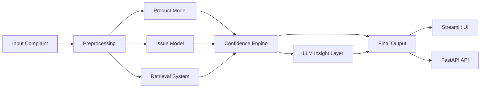

# Architecture Diagram

```mermaid
flowchart LR
    A[Input Complaint]
    B[Preprocessing]
    C[Product Model]
    D[Issue Model]
    E[Retrieval System]
    F[Confidence Engine]
    G[LLM Insight Layer]
    H[Final Output]
    I[Streamlit UI]
    J[FastAPI API]

    A --> B
    B --> C
    B --> D
    B --> E
    C --> F
    D --> F
    E --> F
    F --> G
    F --> H
    G --> H
    H --> I
    H --> J
```

This diagram can be pasted directly into GitHub Markdown, Mermaid Live Editor, or most report tooling.
